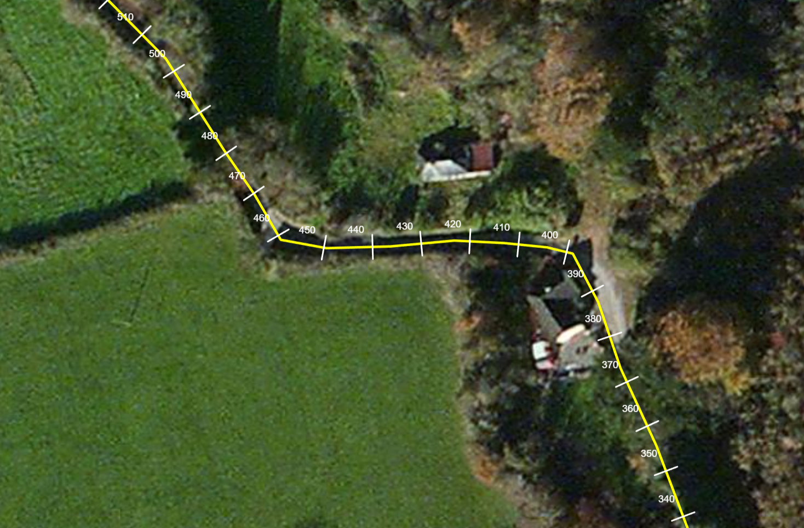

# ol-chainage

Adds chainage markers to an OpenLayers geometry.



## Build

To generate a build ready for production:

```
npm install
npm run build
```

## Lint and Format

```
npm run lint:fix
npm run format
```

## Usage

```js
import {
  addChainageMarkers,
  LineSliceHighlight
} from 'ol-chainage';

const ticks = addChainageMarkers(coords, map.getView().getProjection());
const chainageSource = new VectorSource();
chainageSource.addFeatures(ticks);
const chainageLayer = new VectorLayer({
    source: chainageSource,
    minZoom: 18,
});
map.addLayer(chainageLayer);

```

Also see the example application.

The module can also be used in older applications using the .umd.js file. 

```js
<script src="node_modules/ol-chainage/dist/index.umd.js"></script>

<script>
  // Use via global
  const chainage = OlChainage.createChainage(...);
</script>
```
