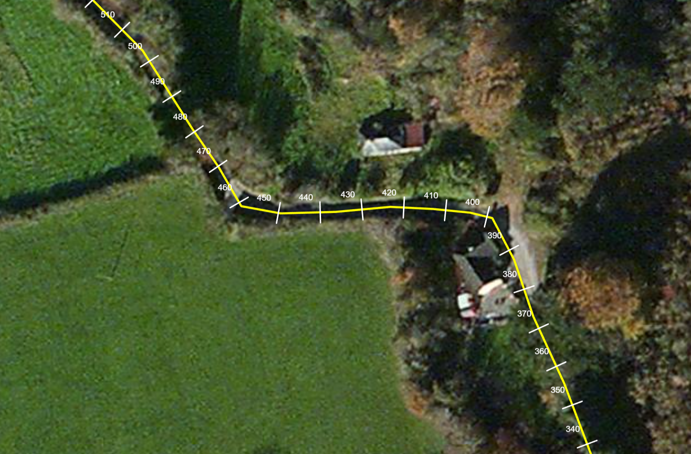

# ol-chainage

Adds chainage markers to an OpenLayers geometry.



## Build

To generate a build ready for production:

```
npm install
npm run build
```

## Lint and Format

```
npm run lint:fix
npm run format
```

## Usage

`addChainageMarkers` and `LineSliceHighlight` both expect coordinates in
**EPSG:4326** (lon/lat), because measurement is done with Turf. The
`mapProjection` argument is the projection the returned features are drawn in.

```js
import {
  addChainageMarkers,
  LineSliceHighlight,
  convertCoords,
} from 'ol-chainage';


const mapProjection = map.getView().getProjection();

// lineGeom is an ol/geom/LineString in the map projection
const coords4326 = convertCoords(
  lineGeom.getCoordinates(),
  mapProjection,
  'EPSG:4326',
);

const ticks = addChainageMarkers(
  coords4326,
  mapProjection,
  lineGeom.getLength(), // referenceLength — see Accuracy below
);

const chainageSource = new VectorSource();
chainageSource.addFeatures(ticks);
const chainageLayer = new VectorLayer({
    source: chainageSource,
    minZoom: 18,
});
map.addLayer(chainageLayer);

```

### Highlighting a slice

```js
const highlighter = new LineSliceHighlight();
const geom4326 = new LineString(coords4326);

// highlight from chainage 100 m to 400 m
highlighter.highlightSlice(
  geom4326,
  100,
  400,
  map,
  false, // useOpenLayers — use the Turf implementation
  lineGeom.getLength(),
);

highlighter.removeHighlight();
```

Also see the example application.

The module can also be used in older applications using the .umd.js file. 

```js
<script src="node_modules/ol-chainage/dist/index.umd.js"></script>

<script>
  // Use via the OlChainage global
  const ticks = OlChainage.addChainageMarkers(
    coords4326,
    map.getView().getProjection(),
    lineGeom.getLength(),
  );
  const highlighter = new OlChainage.LineSliceHighlight();
</script>
```
